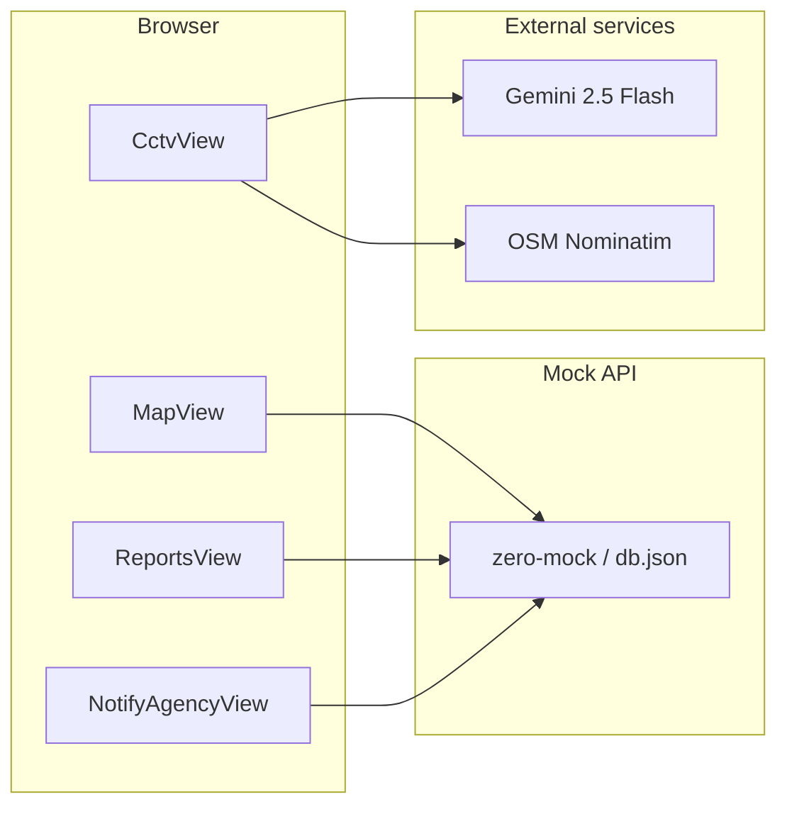

# geo-care-network

Map-based incident reporting for geographic care networks, with CCTV/dashcam crash detection via Gemini and an agency triage workflow. Sample data targets the Chiang Mai area.

## Features

- **Map view** (`/`) — Leaflet map with severity filters, report pins, and quick actions (create, edit, delete).
- **Reports list** (`/reports`) — Browse all filed incidents.
- **Manual reports** (`/reports/new`, `/reports/:id/edit`) — Create or edit reports with category, severity, status, and map-picked location (modal routing when opened from the map).
- **CCTV analysis** (`/cctv`) — Upload a dashcam/CCTV clip; Gemini runs a 3-pass ensemble to detect crashes, extract Thai title/description, reverse-geocode GPS when present, and auto-file a report.
- **Agency notify** (`/notify`, `/notify/archived`) — Triage queue for CCTV-sourced reports still in `open` status; acknowledge and resolve with activity log entries.

Model output titles and descriptions are **Thai** by design (casual, eyewitness tone). The README is in English for developers.

## Tech stack

| Layer | Choice |
|-------|--------|
| UI | React 19, TypeScript, Vite 8 |
| State / API | Redux Toolkit, RTK Query |
| Routing | React Router 7 |
| Maps | Leaflet, react-leaflet |
| Dev API | [zero-mock](https://www.npmjs.com/package/zero-mock) over `db.json` |
| CCTV AI | Google Gemini `gemini-2.5-flash` (browser, via API key) |
| Geocoding | OpenStreetMap Nominatim (no API key) |

## Prerequisites

- Node.js and npm
- A [Google AI Studio](https://aistudio.google.com/app/apikey) API key (required for `/cctv` video analysis)

## Quick start

```bash
npm install
cp .env.example .env
# Edit .env: set VITE_API_URL and VITE_GEMINI_API_KEY
```

Run the mock API and the dev server in two terminals:

```bash
# Terminal 1 — REST API from db.json on port 3000
npm run mock

# Terminal 2 — Vite dev server (default http://localhost:5173)
npm run dev
```

Open the app URL printed by Vite. Without `npm run mock`, report fetches will fail.

## Environment variables

| Variable | Required | Description |
|----------|----------|-------------|
| `VITE_API_URL` | Yes (prod build) | Base URL for the reports API, e.g. `http://localhost:3000` |
| `VITE_GEMINI_API_KEY` | For `/cctv` | Google AI Studio key; sent from the browser to Gemini |

See [.env.example](.env.example). In development, `reportsApi` falls back to `http://localhost:3000` when `VITE_API_URL` is unset, but production builds require it.

## Scripts

| Command | Description |
|---------|-------------|
| `npm run dev` | Start Vite dev server |
| `npm run build` | Production build |
| `npm run preview` | Preview production build |
| `npm run typecheck` | TypeScript project references check |
| `npm run lint` | ESLint |
| `npm run mock` | Serve `db.json` with zero-mock on port 3000 |

## Architecture



### Routes

| Path | Page | Purpose |
|------|------|---------|
| `/` | MapView | Map, filters, report CRUD entry points |
| `/reports` | ReportsView | Report list |
| `/reports/new` | NewReportPage | Manual report (also as modal over map) |
| `/reports/:id/edit` | EditReportPage | Edit existing report |
| `/cctv` | CctvView | Video upload → AI analysis → file report |
| `/notify` | NotifyAgencyView | Agency triage queue |
| `/notify/archived` | NotifyAgencyView | Archived / resolved queue view |
| `/pulse` | — | Redirects to `/cctv` |
| `/home` | — | Redirects to `/` |

Defined in [src/App.tsx](src/App.tsx).

### CCTV pipeline

1. User selects a video file (max **15 MB** inline: `MAX_INLINE_BYTES` in [src/features/cctv/geminiAnalyze.ts](src/features/cctv/geminiAnalyze.ts)).
2. Optional GPS from MP4/MOV metadata ([src/features/cctv/extractVideoGps.ts](src/features/cctv/extractVideoGps.ts)).
3. Reverse geocode via Nominatim ([src/features/cctv/reverseGeocode.ts](src/features/cctv/reverseGeocode.ts)).
4. **3-pass Gemini ensemble** (`gemini-2.5-flash`, temperature seeds `11`, `47`, `89`) — majority vote on `is_crash`; highest severity wins ties.
5. If crash detected: POST report with `source: "cctv"`, `reporter: "CCTV Auto-Detect"`, Thai `title`/`description`, optional JPEG thumbnail data URL, and initial `activityLog` entry.

Implemented in [src/pages/CctvView.tsx](src/pages/CctvView.tsx) and [src/features/cctv/geminiAnalyze.ts](src/features/cctv/geminiAnalyze.ts).

## Project layout

```
geo-care-network/
├── src/
│   ├── pages/              # MapView, ReportsView, CctvView, NotifyAgencyView, …
│   ├── features/
│   │   ├── reports/        # RTK Query API (reportsApi.ts)
│   │   └── cctv/           # Gemini analyze, GPS extract, reverse geocode
│   ├── components/         # ReportMap, TopBar, LocationPickerMap, …
│   ├── app/                # Redux store and hooks
│   └── types/              # Report, Severity, ActivityLogEntry, …
├── db.json                 # Mock REST data (reports collection)
├── ai-sandbox/             # Optional offline Gemini batch tester
├── .env.example
└── package.json
```

## Data model

Core types live in [src/types/index.ts](src/types/index.ts).

| Field / type | Notes |
|--------------|-------|
| `Report` | `id`, `title`, `description`, `category`, `status`, `severity`, `reporter`, `address`, `lat`, `lng`, `filed`, `updated`, … |
| `ReportSource` | `"cctv"` \| `"manual"` |
| `ReportStatus` | `"open"` \| `"in progress"` \| `"resolved"` |
| `Severity` | `"safe"` \| `"warning"` \| `"danger"` |
| `ReportCategory` | `"environment"` \| `"infrastructure"` \| `"safety"` |
| `activityLog` | Append-only timeline (`Report filed`, `Acknowledged by agency`, …) |
| `cctvCrashDetected` | Snapshot of AI `is_crash` at filing time |
| `thumbnailUrl` | JPEG data URL from video frame capture |

REST endpoints (via RTK Query in [src/features/reports/reportsApi.ts](src/features/reports/reportsApi.ts)): `GET/POST /reports`, `GET/PATCH/DELETE /reports/:id`.

## CCTV / Gemini analysis

- **Model:** `gemini-2.5-flash`
- **Passes:** 3 (seeds 11, 47, 89); UI shows agreement note (e.g. `3 of 3 passes agreed`)
- **Response JSON:** `is_crash`, `title`, `description`, `severity`, `category` — no extra keys

The app sends the **Thai** production prompt at runtime. The English version below documents the same rules for developers.

### Gemini analysis prompt (English)

> Source of truth at runtime: Thai string `PROMPT` in [src/features/cctv/geminiAnalyze.ts](src/features/cctv/geminiAnalyze.ts). Output `title` and `description` remain Thai.

```
Analyze this dashcam / CCTV clip as an eyewitness telling a friend what happened. Decide whether a collision occurred.
Reply with a single JSON object only. No other text or markdown outside the JSON.

IRON RULE: Watch the clip from second 0 through the last second, every second. Do not summarize from only the opening segment, skip frames, or decide before the clip ends — crashes may occur in the final seconds, or wreckage may only become clear in late frames.

Thinking steps (do mentally before answering — do not write these in JSON; do not skip any step):
1) Scan the first, middle, and last frames first — Are there already overturned/damaged cars, cars against walls, cars in ditches, cars at unnatural angles, cars parked oddly (middle of road, on median, against guardrails), scattered glass/debris, oil slicks, smoke/fire, people lying motionless on the road, people standing by wreckage? If accident wreckage appears in any frame → is_crash = true immediately. You do not need to see the impact moment — the crash may have happened before the clip, off-frame, or in a second missed by frame sampling.
2) Track all actors through the full clip — At each time segment: how many vehicles? Which look normal vs abnormal (tilted, flipped, crushed, oddly parked)? How many motorcycles/bicycles? Pedestrians? People crossing? People on the roadside? Objects on the road (phones, bags, bottles, glass) fallen or rolling?
3) Walk through the clip in ~1 second steps from 0 to the end — For each second, what is each actor doing (direction, approximate speed, changes)? If the clip is 12 seconds, check all 12 — do not stop at second 3 or 5 and conclude.
4) Mark suspicious moments — Sudden braking? Someone cutting in / jaywalking? Objects falling? Abnormal closing distance? Brake lights flashing? Odd stop/crash positions? Lead vehicle jolt from impact?
5) For each suspicious moment — Zoom mentally through frames before/during/after possible contact. Was there actual contact, even slight?
6) Find the cause — If there was a crash, what triggered it? Cut-off? Jaywalker? Debris? Lock-up? Slippery road? Rain? Do not stop at “car overturned in the road” — explain why it overturned.
7) If still unsure — Secondary cues: people exiting to inspect? Two vehicles stopped abnormally close? People talking roadside after stops? Ambulance/police/flashing lights in frame?
8) Consistency check — CRITICAL — If step 1 shows wreckage (overturned car, unnatural tilt, debris, people gathered at a scene) but step 5 shows no impact moment, do NOT answer is_crash = false. Physical evidence outweighs missing impact footage. Answer is_crash = true and note in description that wreckage from an earlier/off-frame crash was visible.
9) Final decision → Put results in JSON; narrate start → what happened → how it ended.

Language rule for model output: Write "title" and "description" in casual spoken Thai (not overly formal). Medium length, vivid. Colloquial verbs are fine.

Collision definition (is_crash = true) — all severities:
- Any vehicle-to-vehicle contact, however light (rear-end, sideswipe, scrape, tap, mirror clip, etc.)
- Vehicle hits person / motorcycle / bicycle at any severity
- Vehicle hits obstacle (pole, guardrail, sign, wall, debris) with clear impact or clear evidence (e.g. hard brake + deformation, dust at impact point)
- Loss of control into anything, even briefly
- Visible accident wreckage in the clip counts as crash even without seeing the impact moment (overturned car, car in ditch, against guardrail, crushed car stopped in lane, glass/plastic/oil on road, person motionless by car, people by wreckage, ambulance/police at scene) → is_crash = true (may be pre-clip or off-frame)

is_crash = false only when all vehicles, people, and objects pass without contact AND no wreckage or accident traces appear in any frame for the entire clip.

How to watch:
- First second to last; never stop mid-clip
- Frame-by-frame; light impacts can last a fraction of a second
- Extra care in poor visibility (rain, night, glare, blur) — light impacts are common there
- Look for cues even when impact is brief: hard brake, brake flash, bumper/body damage, debris spray, odd stops, people inspecting damage
- If unsure about contact, bias toward is_crash = true and explain uncertainty in description (false negatives are worse than false positives)

Field rules — all required; no extra keys:
- "is_crash": boolean (true or false only, not a string)
- "title": short spoken-style Thai summary
- "description": eyewitness narrative in time order: cause → collision → outcome (who did what first, who hit whom how, injuries/damage afterward; not too short or too long)
- "severity": one of ["safe", "warning", "danger"]
  • "danger" = clear injury or person ejected; hit pedestrian/motorcycle/bicycle; rollover; fire/dark smoke/fuel leak; multi-vehicle pile-up; high-speed impact with meaningful injury risk — needs both injury risk AND heavy damage
  • "warning" = collision with minor–moderate damage (rear-end, sideswipe, scrape) but no clear injury; even heavy vehicle damage can be warning if everyone appears able to walk away
  • "safe" = no collision
- "category": one of ["environment", "infrastructure", "safety"]
  • "safety" for vehicle/person incidents
  • "infrastructure" when the main issue is road/sign/lighting failure
  • "environment" when the main issue is debris/flooding/weather
```

## AI sandbox (optional)

Isolated Node tooling to batch-test videos against Gemini outside the React app.

```bash
cd ai-sandbox
npm install
echo "GEMINI_API_KEY=your_key_here" > .env
# Drop .mp4 / .mov files into ai-sandbox/dataset_videos/
npm test
```

See [ai-sandbox/run_test.js](ai-sandbox/run_test.js). Uses `GEMINI_API_KEY` (not `VITE_*`). Writes results to `results.json`.

## Troubleshooting

| Symptom | Likely cause |
|---------|----------------|
| `VITE_API_URL is not set` on build | Set `VITE_API_URL` in `.env` for production builds ([reportsApi.ts](src/features/reports/reportsApi.ts)) |
| Empty map / failed loads | `npm run mock` not running or wrong `VITE_API_URL` |
| CCTV upload rejected | File over 15 MB (`MAX_INLINE_BYTES`) |
| Wrong map location after upload | No GPS in video metadata — adjust pin manually; defaults exist in CctvView |
| Address field empty | Nominatim rate limit or no result — user can type address manually |
| Gemini errors | Missing/invalid `VITE_GEMINI_API_KEY`, quota, or network |

## Status

Private prototype (`"private": true` in package.json). Uses a local mock API (`db.json`), not a production backend.
